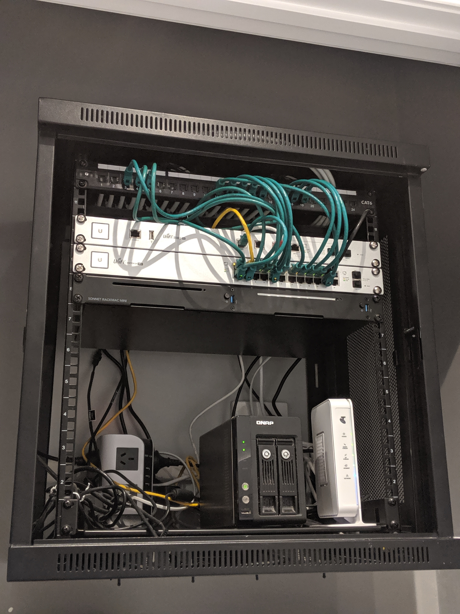
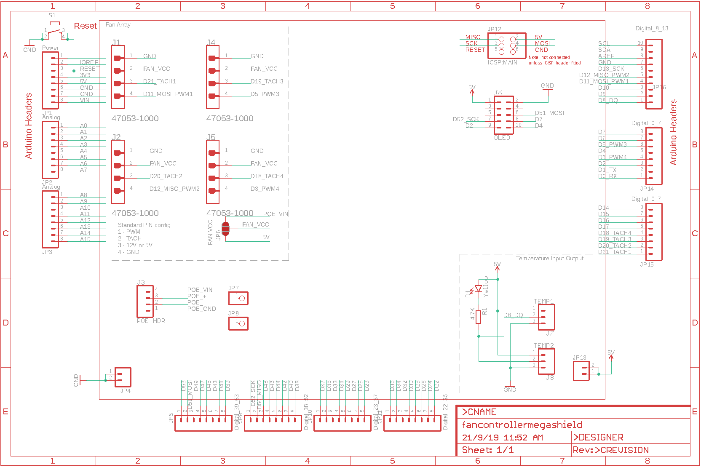
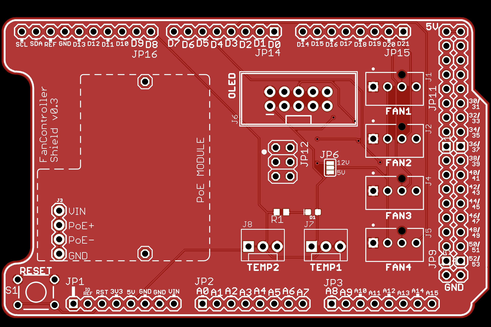
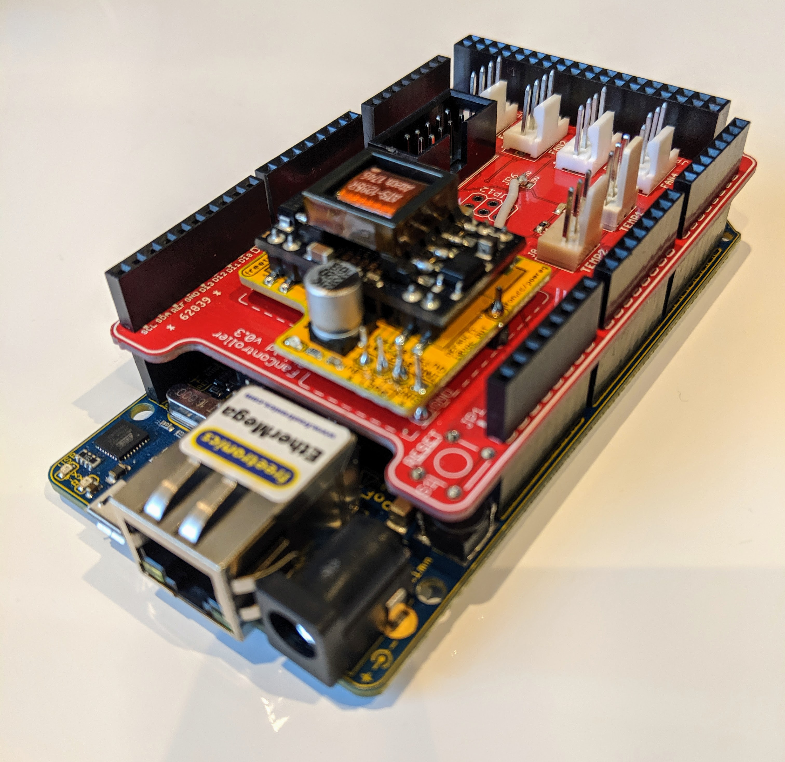
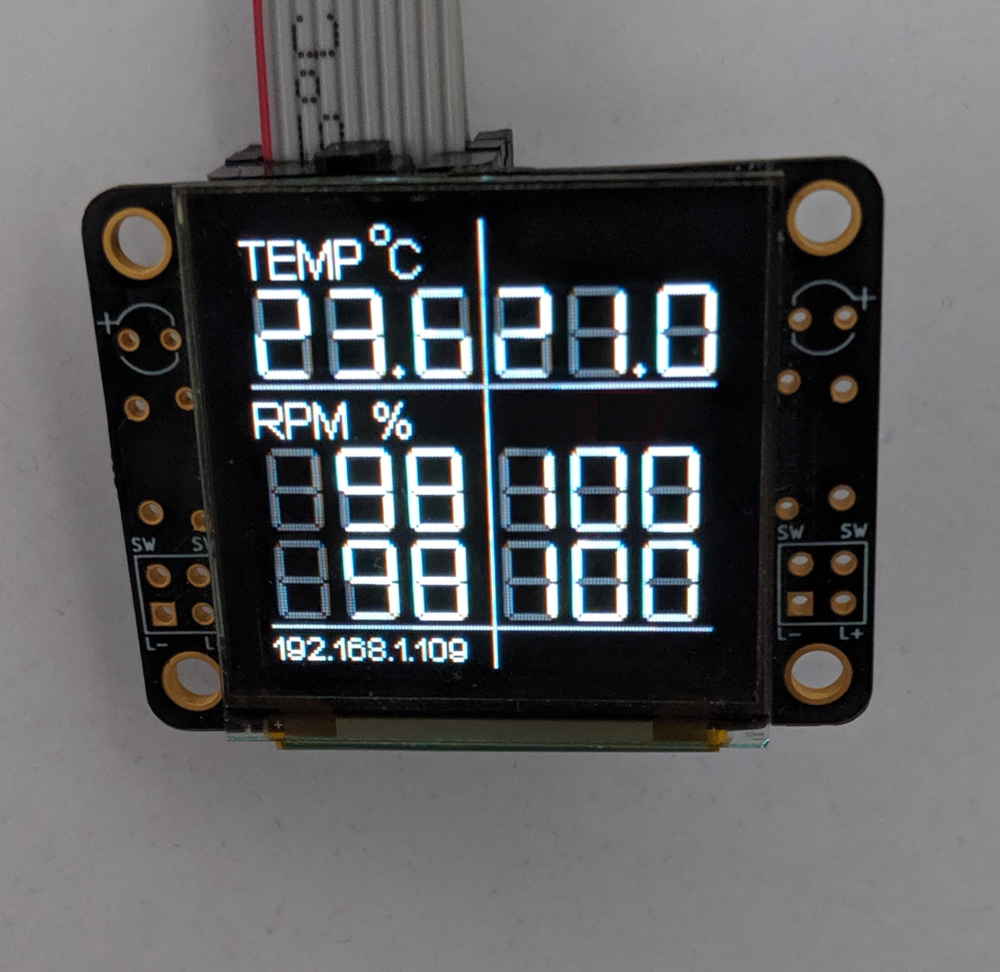
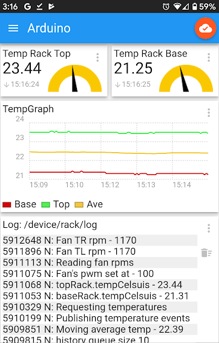

# Arduino Rack Temperature Controller

- To temperature control and monitor a small (12U) network rack system using PWM fans and thermometers managed using an Arduino Mega with a custom designed shield:



**Plan** is to have
- 4 fans mounted (2 top and 2 base) in the rack
- 2 temperature sensors one at the top and base

# Features and Specification
* Uses [Freetronics EtherMega](https://www.freetronics.com.au/collections/arduino/products/ethermega-arduino-mega-2560-compatible-with-onboard-ethernet#.XXMqnZMzY0o) Arduino board although likely any Mega board can reuse the shield
* Shield outline derived from Jonathan Oxer's [ProtoShieldMega](https://github.com/freetronics/ProtoShieldMega)
* Power over Ethernet 802.3af support using [Freetronics PoE module](https://www.freetronics.com.au/products/power-over-ethernet-regulator-8023af) to power the board (and reset it), thermometers, fans and display to simplify power and wire management
* Measures temperatures using [DS18B20](https://makeradvisor.com/tools/ds18b20-digital-temperature-sensor/) housed in metal cable assembly with an accuracy of +/- 0.5&deg;C
* Uses [Freetronics OLED](https://www.freetronics.com.au/pages/oled128-quickstart-guide) via SPI to display the temperature and fan states of the rack
* Works with PWM fans of either 5 or 12V and supports configurable frequency (default 25kHz)
* Uses an [passive infrared sensor](https://www.keyestudio.com/2016-new-keyestudio-pir-motion-sensor-for-arduino-p0488-p0488.html) to prevent burn in for OLED display, only enabling the display on a PIR trigger
* Monitors and displays fan tachometer output to verify RPM is within expected range and fan has not stalled
* Publishes all fan, temperature, error states and logs to an MQTT endpoint and topics for analysis and visualisation
* Software must support any number of temperature devices and fans to enable testing and reuse

# Initial Design
Initial design was based on a separate (non-shield) board using a [MAX31790](https://www.maximintegrated.com/en/products/sensors/MAX31790.html) for fan PWM control and tach measurement integrated with an Arduino Uno using I<sup>2</sup>C. However due to Uno memory limitations of <32k, I upgraded to the Mega with 256k. Code is however included under [MAX31790FanControl.cpp](src/MAX31790FanControl.cpp).

Using a Mega also enabled the PWM control and tach measurement to be done by the Mega pinout and all in software simplifying the overall hardware solution.

# Shield Design
The shield design outline is based on [ProtoShieldMega](https://github.com/freetronics/ProtoShieldMega). The top side of the PCB layout is illustrated. The schematic and PCB design files are under [Eagle](/Eagle). EAGLE PCB design software is available from https://www.autodesk.com/products/eagle/free-download and is free for non-commercial use.

## Pin Mapping
| Pin | Mapping |
|-----|---------|
|2, 4, 7| OLED DC, Reset, CS |
|8      | Onewire DS for thermos |
| 11, 12, 5, 3 | Fan PWM 1-4 |
| 18, 19, 20, 21 | Fan Tach 1-4 for RPM interrupts |
| 6 | IR sensor |

## Schematic


## PCB


## Manufacture
I used [DirtyPCBs](https://dirtypcbs.com/store/pcbs) to manufacture the boards. They also support [design rules checking and CAM Gerber export](https://dirtypcbs.com/store/pcbs/about#cam) for EAGLE, which ensures the PCB layout conforms to their manufacture processes and the Gerber files produced will pass.

I then soldered (or used solder paste for surface mount) the parts in place. For the surface mount work, I used a heat gun and roughly followed the [heat profile](http://www.chemtools.com.au/download/technical-and-safety-data-sheets/solders-pastes-and-fluxes/SAC305CR318%20SAC305%20Solder%20Paste/SAC305CR318%20TDS.pdf) by modifying the gun temperature manually. [YouTube videos](https://www.youtube.com/watch?v=W0BhGieg4II) explain how to do this. 

## Shield Mounted
The shield mounted with the EtherMega.



Minor error on the power circuit which required a track cut and wire from VIN to Fan power. This has been corrected on the Eagle files.

# Display
OLED display to render fan and temperature states showing the fan temperatures in the top row, and the fan RPMs as a percentage of maximum RPM in the lower rows. The fan RPM % does not always accurately map to the input PWM duty cycle - the [fans](https://noctua.at/en/nf-s12b-redux-1200-pwm/specification) I am using have a +/- 10% variance on RPM. 



## Font Generation for OLED
Generated new fonts using [GLDCFontCreator](https://github.com/freetronics/FTOLED/wiki/Displaying-Text#defining-new-fonts).

## MQTT Dashboard
I used the mobile app [IoT MQTT Panel](https://play.google.com/store/apps/details?id=snr.lab.iotmqttpanel.prod&hl=en) to render the MQTT topics which supports configurable panels per topic and different rendering options:



# Code 
Development done using [PlatformIO](https://platformio.org/) which supports multiple boards and library management.  

## Explanation
The main routine loop executes the [RackTempController](src/RackTempController.cpp) process method below which reads the temperature sensors, adjusts the fan speed based on the temperatures, reads and verifies the fan speed RPM is as requested by the PWM dutycycle within a tolerance and analyses temperature trends using a moving average.

```c++ 
void RackTempController::process(RackState_t& rs) {
    
    // read temperatures
    readTempStates(rs.thermos);

    // adjust fan speeds based on temps
    adjustFanSpeeds(rs);
    
    // read fan tach/rpms - delay of 750ms per fan
    readFanSpeeds(rs.fans);

    // verify fan PWMs matches RPMs
    verifyFanStates(rs.fans);

    // analyse trends
    analyseTrends(rs);
};
```
Thermos and fan configuration is created via [RackTempController::build()](src/RackTempController.cpp#L219) which enables any number of thermos or fans to be used. The OLED display class however, is fixed to the specification above.

## Dependent libraries

All libraries were loaded and managed used PlatformIO's library management. 

| Library | Purpose |
|---------|---------|
| DallasTemperature | Measures temperature of DS18* devices using OneWire |
| FTOLED  | Graphics library to drive OLED |
| SD      | Dependency for FTOLED - not used |
| Ethernet | Ethernet, DHCP support |
| ArduinoMqttClient | MQTT client |
| TimerOne | PWM control for Timer1 |
| TimerThree | PWM control for Timer3 |
| ArduinoLog | Logging framework |
| ArduinoSTL | STL library used for map, vector etc |


# TODO
- Update this README!
- Create a config endpoint - possibly via MQTT subscribe to enable changes to MQTT params, temp threshold etc. 
- Improve MQTT events
- Watchdog via AWS lambda which reboots via PoE
- Mount in rack - 3d print something
- Look at FreeRTOS and work out if its worth it
- Make it cheaper

# Credits
First and foremost to [Jonathan Oxer](https://www.patreon.com/superhouse).

Secondly all the excellent library contributors used in the project.

# License
TBD
